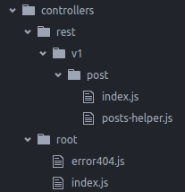

# koa-folder-routes
Create koa routes with folder path appended.

Eg:



***Steps***

1.&nbsp;Create your [koa-router](https://github.com/alexmingoia/koa-router)  objects like below:
	
&nbsp;&nbsp;&nbsp;	***controllers/rest/v1/post/index.js***
	
```javascript
	var router = require("koa-router")();

	router.get("post","/:id", function *(next) {
	  var id = parseInt(this.params.id);
	  var postsHelper = PostsHelper(this.mongo);
	  this.body = yield postsHelper.getPostById(id);
	});

	router.allowedMethodsObject = {
	  throw: true,
	  notImplemented: () => new Boom.notImplemented(),
	  methodNotAllowed: () => new Boom.methodNotAllowed()
	};

	module.exports = router;
	
```
Now this will be available at http://localhost:8080/rest/v1/post/10
	
2.&nbsp;The koa-router objects present under *controllers/root/* are put up directly to the context path.
	&nbsp;&nbsp;&nbsp;&nbsp;http://localhost:8080/
3.&nbsp;Configuration:

&nbsp;&nbsp;&nbsp;	***app.js***
	
```javascript
	var routesloader = require('koa-folder-routes');
	routesloader(app);
	
```
&nbsp;&nbsp;&nbsp;	***config/default.json***

```javascript
		"routes": {
    			"directory": "controllers"
    		}
		
```
	
&nbsp;&nbsp;&nbsp;&nbsp; ***OR***

&nbsp;&nbsp;&nbsp;	***app.js***
	
```javascript
	var routesloader = require('koa-folder-routes');
	routesloader(app,'controllers'); 
	
```

***The folder path needs to be referenced from the project's directory (excluding project's directory name).***

4.&nbsp;You can have all the configuration and features offered by [koa-router](https://github.com/alexmingoia/koa-router)  in your router files (controllers/rest/v1/post/index.js in our example.)